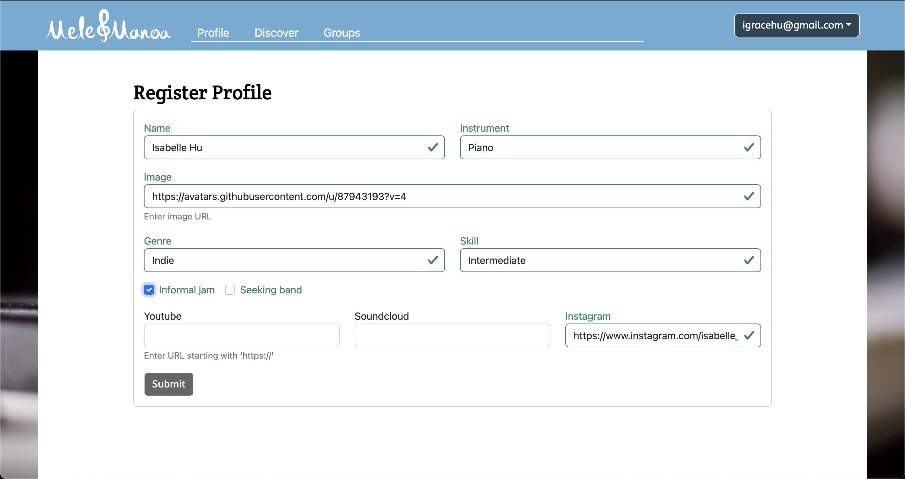
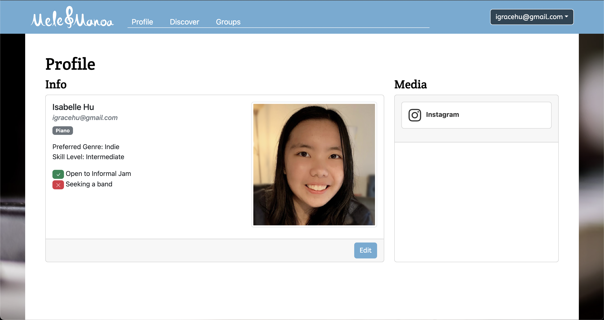
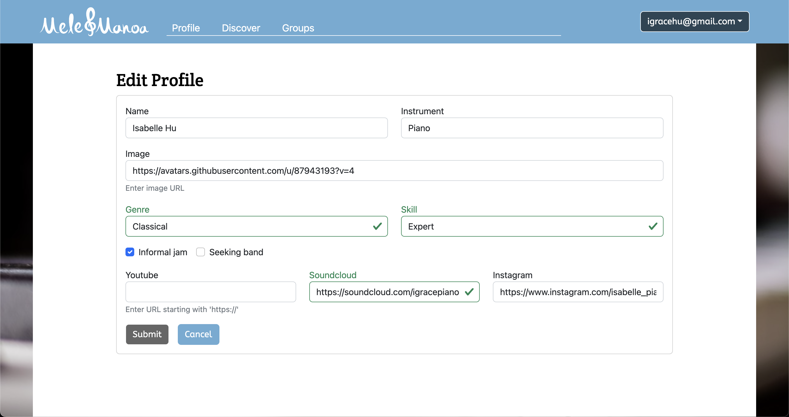
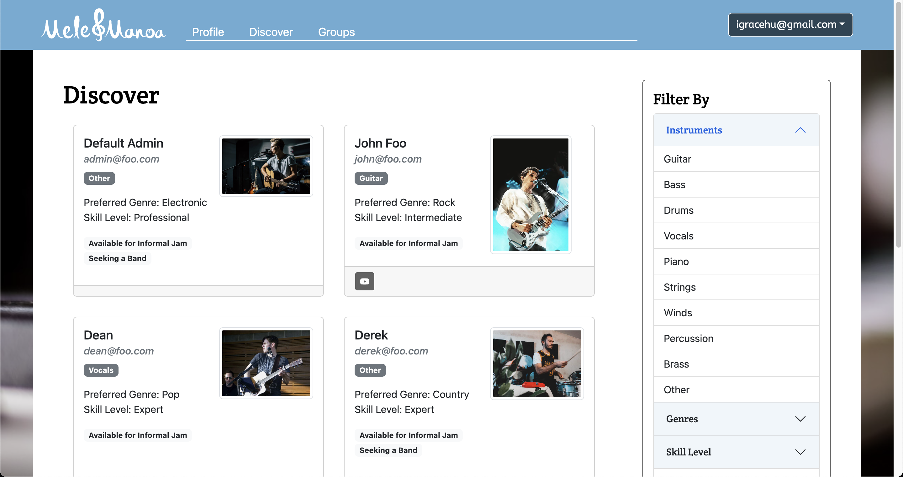
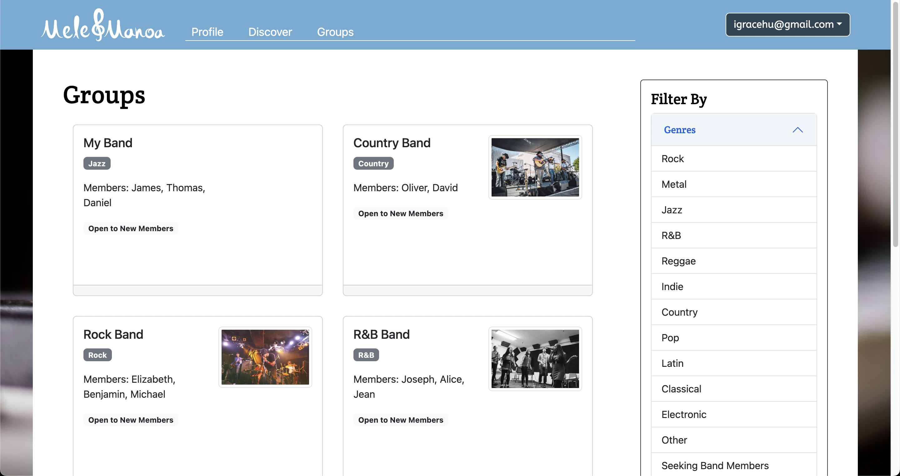

# Mele Manoa

## Table of Contents
- [Overview](#overview)
- [User Guide](#user-guide)
- [Community Feedback](#community-feedback)
- [Developer Guide](#developer-guide)

## Overview
Mele Manoa is a web application designed to bring musicians of UH together for jam sessions or performing bands. It is an easy way for them to find others with similar tastes and compatible musical abilities, by allowing students to create a profile indicating their musical tastes, their musical capabilities, and their musical goals.

## User Guide
<figure class="figure float-end ps-4">
    
    <figcaption class="figure-caption text-wrap" style="width: 500px"> Current home/landing page </figcaption>
</figure>
Welcome to Mele Manoa! You will first be greeted by this landing page, which you can use to sign in or register using any of the buttons on the page. The sign in and register buttons will allow you to login into your account to start using Mele Manoa. If this is your first time here, after registration you will also be prompted to fill in some information about yourself. This will allow other musicians of UH to find out about you and see who you are on Mele Manoa.
<figure class="figure float-end ps-4">
    
    <figcaption class="figure-caption text-wrap" style="width: 500px"> Register Page </figcaption>
</figure>
<figure class="figure float-end ps-4">
    
    <figcaption class="figure-caption text-wrap" style="width: 500px"> Profile Information </figcaption>
</figure>
All this information will also appear on your profile, which you can edit at any time. You can put in your name, what instrument you play, an image to represent you, what your preferred genre is, and your skill level. Since Mele Manoa wants to allow musicians to come together, There are also two options for you to check: if you are open to informal jams with other musicians, or if you are seeking a band to join. You are also able to add in external social media links to Youtube, SoundCloud, or Instagram to help others understand what kind of music you make. Just make sure the link starts with `https://`!
Once you hit submit, you will find your profile all set and ready for you! If you wish to change your information, simply click the edit button once more and you can edit your information all you want. In this case, I wanted to change my preferred genre and my skill level. I also added in my SoundCloud link.*
<figure class="figure float-end ps-4">
    
    <figcaption class="figure-caption text-wrap" style="width: 500px"> User Profile </figcaption>
</figure>
<figure class="figure float-end ps-4">
    
    <figcaption class="figure-caption text-wrap" style="width: 500px"> Edit Profile. Note: External links are not real and for demonstration purposes only. </figcaption>
</figure>
When you think your profile looks good, head over to the **Discover** page on the navigation bar. Here you will find all your fellow musicians who also use Mele Manoa. You can filter through them using the sidebar on the right, depending on what kind of musicians you're looking for to jam with! The **Discover** page gives you all the information you need about them.
<figure class="figure float-end ps-4">
    
    <figcaption class="figure-caption text-wrap" style="width: 500px"> Discover </figcaption>
</figure>
Then the **Groups** page, this page is for musical groups that have already formed within UH. Like in the **Discover** page, you can also filter through the groups to find your favorites and perhaps one you may be interested in joining.
<figure class="figure float-end ps-4">
    
    <figcaption class="figure-caption text-wrap" style="width: 500px"> Groups </figcaption>
</figure>
Thank you so much for using Mele Manoa!

## Community Feedback
Feedback was compiled by multiple students who are currently studying in UH Manoa, taken anonymously for their privacy. After presenting to them the web application and letting them use it, this was the feedback that we have recieved:
>"Simple and easy to use, great concept and excecuted well."

>"Whoever developed this website was a genius."

>"Good website that's organized and easy to use. Could add a place for people to put a sample of their music or an area inside the website to contact the musicians directly."

>"Doesn't look great on mobile."

>"It was easy to use and very straightforward except image url."

>"It is great to seek different people and musical bands! Also it is easy to use the website."

>"Really easy to use. The image part was kinda confusing cause there's usually a button or something that says 'paste link' or 'upload image'"

## Developer Guide
To modify this web app, go to the [mele-manoa repository](https://github.com/mele-manoa/mele-manoa) on Github. Next, clone mele-manoa to your own local repository by clicking on **Code** and choose which method you prefer the most. I recommend opening it in Github Desktop. Then, name your local repository and open the repository in an IDE of your choice.

Next, open up Terminal on Mac or Command Line on Windows or Linux. Navigate to the /app directory in your repository. Within /app, run `meteor npm install`. This will install all the extra necessary `npm` files.

Then, run `meteor npm run start`.

This process may take a while. After it is finished, you should be able to see the webpage up and running at [localhost:3000](http://localhost:3000/).

## Team Members
Mele Manoa is created, designed, and maintained by
- Kendal Oya
- Tevin Takata
- Yeeun Shin
- Isabelle Hu

[Team Contract](https://docs.google.com/document/d/1zy-giZkrca_htvXo5oxdvaI5PSrM_AwTMCYWHB_XyJM/edit?usp=sharing)

[Milestone 1](https://github.com/orgs/mele-manoa/projects/1/views/1)

[Milestone 2](https://github.com/orgs/mele-manoa/projects/2/views/1)

[Milestone 3](https://github.com/orgs/mele-manoa/projects/3/views/1)

[Deployment](http://138.68.69.79/)
