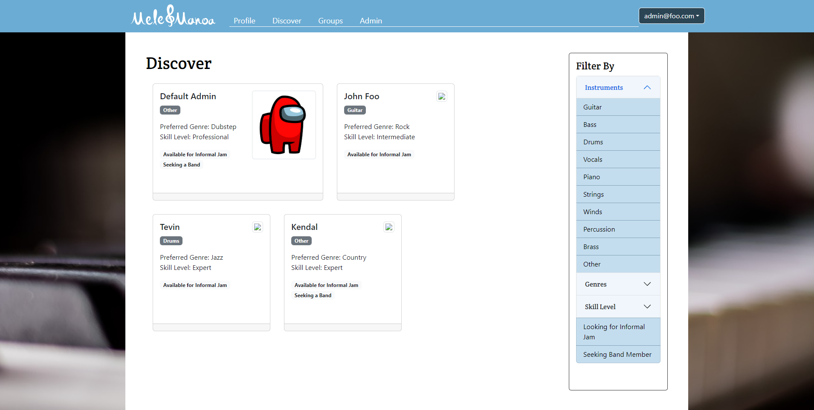
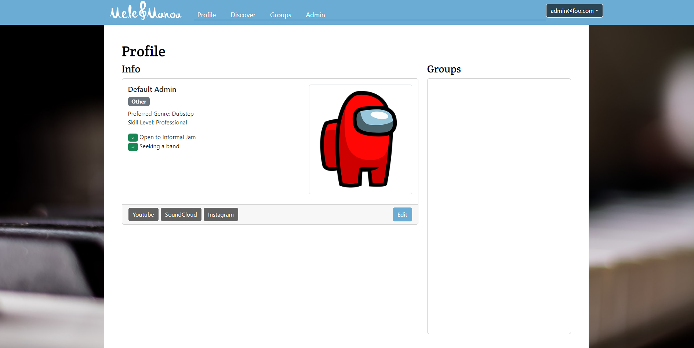
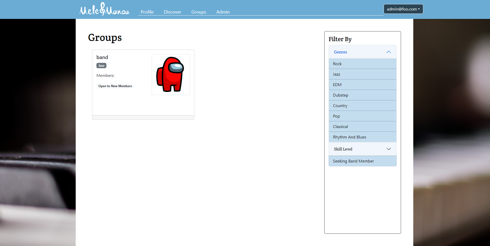
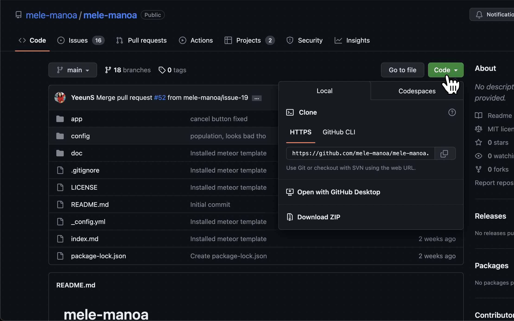
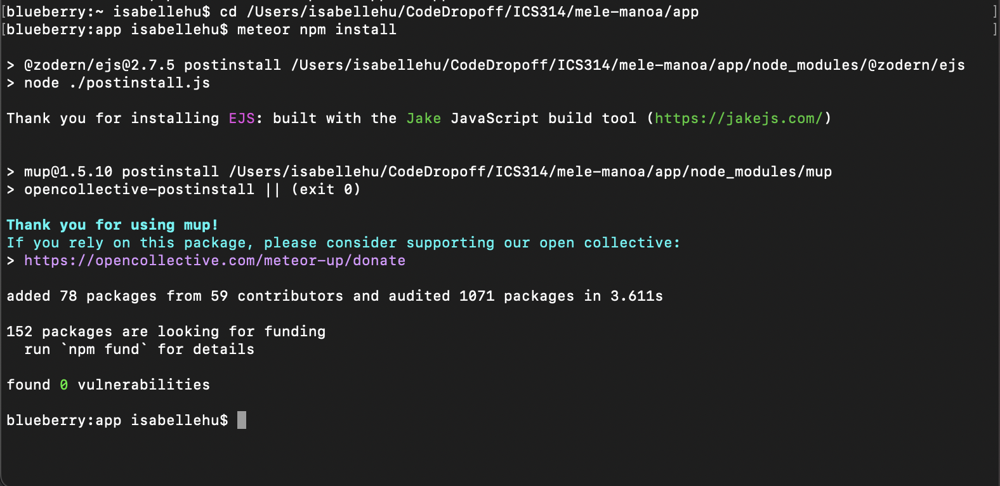
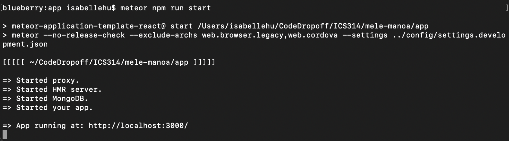

# Mele Manoa

## Overview
Mele Manoa is a web application designed to bring musicians of UH together for jam sessions or performing bands. It is an easy way for them to find others with similar tastes and compatible musical abilities, by allowing students to create a profile indicating their musical tastes, their musical capabilities, and their musical goals.

<figure>
    
    <figcaption class="figure-caption text-wrap" style="width: 500px"> Current home/landing page </figcaption>
</figure>

<figure>
    
    <figcaption class="figure-caption text-wrap" style="width: 500px"> Up to date sign in page. </figcaption>
</figure>

<figure>
    
    <figcaption class="figure-caption text-wrap" style="width: 500px"> Current discover page. </figcaption>
</figure>

<figure>
    
    <figcaption class="figure-caption text-wrap" style="width: 500px"> Current profile page. </figcaption>
</figure>

<figure>
    
    <figcaption class="figure-caption text-wrap" style="width: 500px"> Current Groups Page. </figcaption>
</figure>

## User Guide
Login with your UH username and create your profile. Your profile will include your musical talents and interests, and will be made public for others to see so that you will be able to join groups for jam sessions. Navigate to the 'Discover' page to find others of similar musical interests as yours.
Admin accounts will be able to create more options for instrument groups and genres that the Discover page can be filtered by.

## Developer Guide
To modify this web app, go to the [mele-manoa repository](https://github.com/mele-manoa/mele-manoa) on Github. Next, clone mele-manoa to your own local repository by clicking on **Code** and choose which method you prefer the most. I recommend opening it in Github Desktop. Then, name your local repository and open the repository in an IDE of your choice.

Next, open up Terminal on Mac or Command Line on Windows or Linux. Navigate to the /app directory in your repository. Within /app, run `meteor npm install`. This will install all the extra necesary `npm` files.

Then, run `meteor npm run start`.

This process may take a while. After it is finished, you should be able to see the webpage up and running at [localhost:3000](http://localhost:3000/).

## Team Members
Mele Manoa is created, designed, and maintained by
- Kendal Oya
- Tevin Takata
- Yeeun Shin
- Isabelle Hu

[Team Contract](https://docs.google.com/document/d/1zy-giZkrca_htvXo5oxdvaI5PSrM_AwTMCYWHB_XyJM/edit?usp=sharing)

[Milestone 1](https://github.com/orgs/mele-manoa/projects/1/views/1)

[Milestone 2](https://github.com/orgs/mele-manoa/projects/2/views/1)

[Milestone 3](https://github.com/orgs/mele-manoa/projects/3/views/1)

[Deployment](http://198.211.96.241/#)
